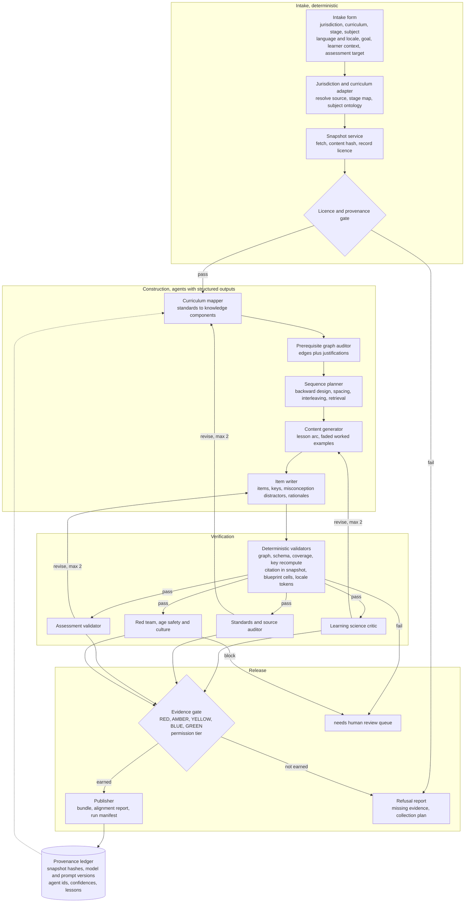
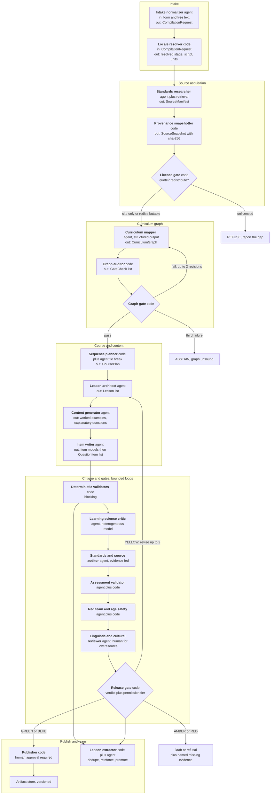
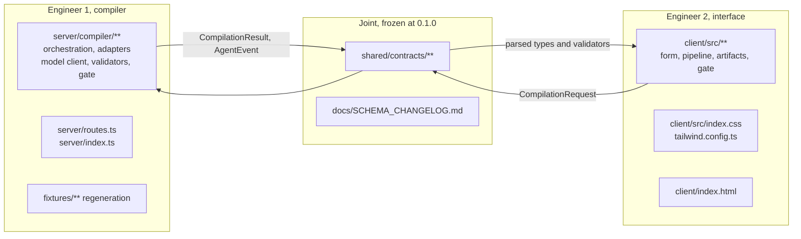

# Primer Compiler: Engineering Handoff

**Read this first. You should not need the 32,000 word research report to start building.**
The report is the evidence layer: [`primer-curriculum-engine-research.pplx.md`](../primer-curriculum-engine-research.pplx.md).
Event rules and the schedule live in [`cursor-austin-grok-4-6-hackathon.md`](../cursor-austin-grok-4-6-hackathon.md) and
[`cursor-austin-grok-4-6-linked-resources.md`](../cursor-austin-grok-4-6-linked-resources.md).

Written for two engineers building in parallel on Saturday, August 15, 2026. Submissions close at 3:00 PM CT and
the form should be started by 2:40 PM ([hacker resource guide](https://huntertcarver.notion.site/Cursor-Austin-Grok-4-6-Hackathon-Hacker-Resource-Guide-3bc071360df881c98dc0c7f1b08c1506)).

---

## Contents

1. [Executive summary](#1-executive-summary)
2. [The problem](#2-the-problem)
3. [Vision versus the five hour slice](#3-vision-versus-the-five-hour-slice)
4. [Users and jobs to be done](#4-users-and-jobs-to-be-done)
5. [Positioning](#5-positioning)
6. [Product requirements](#6-product-requirements)
7. [Case selection and the demo](#7-case-selection-and-the-demo)
8. [How the system works end to end](#8-how-the-system-works-end-to-end)
9. [The agent graph](#9-the-agent-graph)
10. [Agents versus deterministic code](#10-agents-versus-deterministic-code)
11. [Learning science stack](#11-learning-science-stack)
12. [Curriculum engineering and the question bank](#12-curriculum-engineering-and-the-question-bank)
13. [The universal adapter set](#13-the-universal-adapter-set)
14. [Tech stack and rationale](#14-tech-stack-and-rationale)
15. [Data and artifact model](#15-data-and-artifact-model)
16. [Evaluation harness and claim discipline](#16-evaluation-harness-and-claim-discipline)
17. [Privacy and child safety](#17-privacy-and-child-safety)
18. [Risks and open questions](#18-risks-and-open-questions)
19. [Post hackathon roadmap](#19-post-hackathon-roadmap)
20. [Two engineer split, contract, protocol, timeline](#20-two-engineer-split-contract-protocol-timeline)
21. [Submission checklist and claim discipline](#21-submission-checklist-and-claim-discipline)
22. [Quickstart and definition of done](#22-quickstart-and-definition-of-done)
23. [Source of truth hierarchy and schema change process](#23-source-of-truth-hierarchy-and-schema-change-process)

---

## 1. Executive summary

Primer Compiler treats curriculum construction as a compilation problem. There is a source of truth, an official
curriculum. There is a target, a learner with a goal. There is an intermediate representation, a prerequisite graph of
knowledge components. There is an output, a sequenced course plus a validated item bank. Compilers are trusted because
they are deterministic where they can be and loud where they cannot be.

The product accepts a jurisdiction, a curriculum source, a stage, a subject, a language and script, a learner context and
an optional assessment target. It emits a curriculum knowledge graph, a scope and sequence, lessons, an item bank, and a
gate report stating what the artifacts have earned the right to be used for. When the evidence is not there, it refuses
and names what is missing.

The differentiating mechanism is borrowed from the team's existing public work: authority must be measurably earned. The
writing engine states the rule as "nothing gets authority it has not measurably earned," implemented as deterministic
validators, an independent evaluator that may abstain, evidence gates with permission tiers, a frozen benchmark, and a
human publishing gate with no publish path in the code ([writing-engine README](https://github.com/supe-log/writing-engine),
[evidence-gates](https://github.com/supe-log/writing-engine/blob/main/docs/evidence-gates.md)). Primer carries that
discipline from grading one essay up to compiling a whole curriculum.

**Why now.** Three things landed at once. The measured learning picture got worse rather than better, so back mapping to
prerequisites is worth more than another grade level worksheet. Model capability crossed the line where a 500,000 token
context window and native structured outputs make whole curriculum reasoning practical
([xAI Grok 4.6 docs](https://docs.x.ai/developers/grok-4-6)). And the generation tools that shipped first competed on
volume rather than on provable alignment, which leaves the trustworthy lane open.

**One line pitch.** Primer Compiler turns any country's official curriculum into a sequenced course and a
standards tagged question bank, and refuses to ship anything it cannot trace to a source, a prerequisite, and a
passing check.

---

## 2. The problem

### 2.1 Three different gaps, which are often confused

| Gap | Question it answers |
|---|---|
| **Proficiency gap** | How many learners are far from the floor right now |
| **Recovery gap** | What has not been regained relative to 2019 |
| **Inequity gap** | Who is falling further behind, and is the spread widening |

A caution that belongs in the product, not only in a footnote: the National Center for Education Statistics states that
"the *NAEP Proficient* achievement level does not represent grade level proficiency as determined by other assessment
standards" and that achievement levels "are to be used on a trial basis and should be interpreted and used with caution"
([NAEP mathematics 2024, grade 8](https://www.nationsreportcard.gov/reports/mathematics/2024/g4_8/?grade=8)). Reading
"not proficient" as "failing" is a misreading.

### 2.2 United States, most recent released main assessments

The 2024 main NAEP reading and mathematics assessments were administered January to March 2024, with about 117,000
students per subject in roughly 6,100 schools
([reading grade 4](https://www.nationsreportcard.gov/reports/reading/2024/g4_8/?grade=4),
[mathematics grade 4](https://www.nationsreportcard.gov/reports/mathematics/2024/g4_8/?grade=4)). The next main results
are scheduled for Winter 2027, so as of August 2026 this is the newest released evidence
([NAEP assessment schedule](https://nces.ed.gov/nationsreportcard/about/calendar.aspx)).

- Reading is worst on all three metrics at once. Thirty three percent of eighth graders scored below *NAEP Basic*, "a
  greater percentage than ever before," and "No state saw reading gains in either grade, compared to 2022"
  ([NAGB, 10 takeaways](https://www.nagb.gov/powered-by-naep/the-2024-nations-report-card/10-takeaways-from-2024-naep-results.html)).
- Grade 8 mathematics carries the deepest unrecovered loss, eight points below 2019, with gains at the 75th and 90th
  percentiles and declines at the 10th and 25th
  ([mathematics grade 8](https://www.nationsreportcard.gov/reports/mathematics/2024/g4_8/?grade=8)).
- The structural finding that should drive the product: "the lowest-performing students generally score about 100 points
  below the highest-performing students in 2024" on a 500 point scale, and that spread has been widening for more than a
  decade ([NAGB](https://www.nagb.gov/powered-by-naep/the-2024-nations-report-card/10-takeaways-from-2024-naep-results.html)).
- Writing has no current national measure at all. The last reported NAEP writing assessment is 2011
  ([NAEP writing 2011](https://www.nationsreportcard.gov/writing_2011/summary.asp)) and writing does not appear in the
  published schedule ([schedule](https://nces.ed.gov/nationsreportcard/about/calendar.aspx)). That is a strategic
  opening, since Texas has scored an extended constructed response at every reading and language arts grade level since
  2022 to 2023 ([STAAR grade 4 scoring guide](https://tea.texas.gov/data-reports/staar/released-test-questions/2026-staar-4-rla-scoring-guide.pdf)).

**Design consequence.** A system that generates one average difficulty course for a grade level aims at the part of the
distribution that is already recovering. The value is below grade level, which is an argument for prerequisite graph back
mapping rather than grade level content generation.

### 2.3 Globally

- Fifty three percent of children in low and middle income countries "cannot read and understand a simple story by the
  end of primary school," and on current trends about 43 percent will still be learning poor in 2030
  ([World Bank learning poverty measure](https://www.worldbank.org/en/topic/education/brief/learning-poverty-measure)).
- 273 million children and youth were out of school as of 2024, and in low income countries that population has
  increased by 29 percent since 2015 ([UNESCO out of school rate](https://www.unesco.org/en/education/view/outofschool)).
- The single most product relevant global fact: 40 percent do not access education in a language they understand, with
  matched comparisons showing large gaps, for example Honduras grade 6 at 94 percent versus 62 percent reaching reading
  basics ([UNESCO GEM](https://www.unesco.org/gem-report/en/articles/40-dont-access-education-language-they-understand)).
- The cost effective global response named by the World Bank panel is structured pedagogy plus targeted instruction at
  the learner's actual level ([GEEAP Smart Buys](https://thedocs.worldbank.org/en/doc/2b1c6e1c5420a3ad9d9e0c790b7ed3a9-0510022024/original/Smart-Buys.pdf)).
  Teaching at the right level is, mechanically, prerequisite graph placement, which is exactly what this product computes.
- Recovery is possible where foundational literacy is prioritized. In rural India, the share of Std III children reading
  a Std II level text rose from 27.0 percent in 2022 to 33.7 percent in 2024
  ([ASER 2024](https://asercentre.org/wp-content/uploads/2022/12/ASER-2024-All-India-ppt-Jan-27-11am.pdf)).

---

## 3. Vision versus the five hour slice

**Long term.** The infrastructure layer under localized adaptive tutors. Adapters for many jurisdictions, a misconception
library that improves with every pilot response, calibrated item banks, knowledge tracing over the graph, native language
authoring with paid reviewers, and a public gate ledger per jurisdiction. A learner facing tutor arrives last, because a
tutor built before the graph and the gate cannot say what it does not know.

**Today, five hours.** A working compiler for one live case with the deterministic half real: adapters, snapshots and
licence records, graph construction with a real acyclicity audit, a cited scope and sequence, lesson and item generation,
deterministic validators that reject, two independent critics with bounded loops, a gate report with a permission tier,
a refusal path, and a UI that shows the pipeline and the artifacts.

**What is explicitly out of scope today:** learner accounts, any student data, adaptivity, calibration, differential item
functioning, a chat tutor, authentication, and any claim about learning gains.

---

## 4. Users and jobs to be done

| Class | Who | Why they adopt |
|---|---|---|
| **Primary, P0** | The curriculum author: teacher, homeschooling parent, tutor, instructional coach, curriculum lead | They must produce a defensible, standards aligned sequence and assessment this week, and today they do it by hand or with generators that cannot prove alignment |
| **Secondary, P1** | The reviewer or approver: department head, assessment specialist, ministry or district officer, native speaker reviewer | They need an audit trail: which standard, which source, which check, who approved |
| **Indirect** | The learner | Receives the compiled course. No learner facing surface exists until the gate earns pilot permission |

Personas worth keeping in your head while building:

- **Maria**, grade 4 teacher in Texas. Twenty two students across three reading levels, forty minutes of planning a day.
  Whatever she uses must be traceable to the student expectation codes her observer checks.
- **Daniel**, homeschooling parent of an eleven year old. His job in his words: "tell me what my kid needs to learn
  before the thing he is stuck on."
- **Amara**, curriculum officer in a non United States ministry. Cannot use a tool that assumes US grade integers.
- **Ravi**, assessment specialist. Rejects any item bank without a blueprint, defensible keys, and distractors traceable
  to misconceptions.
- **Nadia**, native speaker reviewer in a lower resource language, catching terminology drift and culturally alien
  examples before a learner sees them.

Ranked jobs, each with evidence that the job is real:

1. "Tell me what my learner needs before the thing they are failing." Prerequisite placement. The bottom of the
   distribution is falling further behind ([NAGB](https://www.nagb.gov/powered-by-naep/the-2024-nations-report-card/10-takeaways-from-2024-naep-results.html))
   and targeted instruction is a named cost effective global approach ([GEEAP](https://thedocs.worldbank.org/en/doc/2b1c6e1c5420a3ad9d9e0c790b7ed3a9-0510022024/original/Smart-Buys.pdf)).
2. "Build a coherent sequence and show me why it is in that order." Authoritative prerequisite maps already exist as a
   genre ([Achieve the Core coherence map](https://achievethecore.org/page/1118/coherence-map)).
3. "Give me items I can defend to my department." Traditional operational item development runs about 1,500 to 2,500
   dollars per item, so a 2,000 item bank is a 3 to 5 million dollar asset
   ([Gierl and Lai, NCME module 34](https://ncme.org/wp-content/uploads/2025/10/Module-34-Automated-Item-Generation-Gierl-Lai.pdf)).
4. "Do it in my curriculum, my stage names, my language." Jurisdictions use incompatible hierarchies and 40 percent of
   learners are taught in a language they do not understand ([UNESCO GEM](https://www.unesco.org/gem-report/en/articles/40-dont-access-education-language-they-understand)).
5. "Prove it is aligned, and tell me when you are not sure." Intrinsic self correction is unreliable and can degrade
   output ([Huang et al., ICLR 2024](https://arxiv.org/abs/2310.01798)).
6. "Do not get me in copyright trouble." The Texas Education Agency prohibits reproduction without written permission
   ([TEA](https://tea.texas.gov/data-reports/staar/released-test-questions/2026-staar-4-rla-scoring-guide.pdf)), the
   Common Core licence "extends to the Common Core State Standards only and not to the examples"
   ([CCSS public license](https://www.thecorestandards.org/public-license/)), and ACARA material is CC BY 4.0 with named
   exclusions ([ACARA](https://www.australiancurriculum.edu.au/copyright-and-terms-of-use)).

**The Monday test, concretely.** Monday morning, Maria enters three student expectations, a goal and her class context,
and leaves with a six lesson sequence, twelve items with rationales and misconception mapped distractors, a coverage
matrix, and a citation list she can paste into her plan.

---

## 5. Positioning

**Primer Compiler is a universal curriculum compiler and factory. It is not a worksheet generator and not a generic
tutor.**

Say it this way in the demo: the output is not a worksheet, it is a compiled artifact bundle with provenance and a gate
verdict. The engine, not the content, is the product.

What the competitive scan found, which is the whole basis of the position. The graph builders do not claim generation
from official standards. Squirrel AI breaks middle school mathematics into over 10,000 knowledge points linked into a
knowledge graph, with system directed sequencing ([Squirrel AI](https://en.wikipedia.org/wiki/Squirrel_AI)). The
generators do not claim a prerequisite graph. MagicSchool has 80 or more teacher tools grounded in district frameworks
and reports teachers saving 7 to 10 hours a week ([MagicSchool](https://www.magicschool.ai/magic-tools)). Coursebox
produces a curriculum map "in under a minute" across "100+ languages" and names no external standards body on its own
page ([Coursebox](https://www.coursebox.ai/ai-curriculum-generator)). Nobody in the fetched set publishes a refusal
mechanism, a permission tier, or per node provenance.

Four things together are the moat: a prerequisite graph derived from an official source, generation of both instruction
and a validated item bank against that graph, deterministic plus independent judge gates that can abstain and refuse, and
cross jurisdiction and cross language reach with per node provenance.

---

## 6. Product requirements

### 6.1 Goals

| # | Goal | Measurable definition |
|---|---|---|
| G1 | Compile any jurisdiction's curriculum into a teachable, assessable course | Four or more jurisdictions with distinct hierarchies compile to one schema, two or more scripts |
| G2 | Make alignment verifiable rather than asserted | Every node and item traces to a hashed source snapshot span, and the coverage matrix is computed |
| G3 | Refuse rather than mislead | Every run emits a gate verdict and permission tier, and unsupported requests produce a refusal with a named missing evidence list |
| G4 | Respect source licences by construction | Every source carries a licence record and redistribution is blocked in code where the licence forbids it |
| G5 | Author natively in the learner's language | Learner facing content generated in language, with a per language gate that is never inherited from English |
| G6 | Save the author real time | Median author time from blank form to reviewed exportable unit under 30 minutes |
| G7 | Earn adaptivity rather than assume it | Adaptive routing ships only after item calibration and a controlled pilot |

### 6.2 Non goals, stated as hard boundaries

| # | Non goal | Why |
|---|---|---|
| NG1 | No claim of learning gains | Requires a pilot. The honest comparators to eventually beat are intelligent tutoring systems at *d* = 0.76 and adult human tutoring at *d* = 0.79 versus instruction without tutoring ([VanLehn 2011](https://eric.ed.gov/?id=EJ946764)) |
| NG2 | Not a high stakes scoring, placement or accountability system | Those decisions need validity evidence this system does not have |
| NG3 | No redistribution of copyrighted standards text, released items or scoring guides | [TEA](https://tea.texas.gov/data-reports/staar/released-test-questions/2026-staar-4-rla-scoring-guide.pdf), [CCSS licence](https://www.thecorestandards.org/public-license/) |
| NG4 | No student personal information in P0 | Keeps the under 13 collection analysis of the children's privacy rule out of scope for the prototype ([FTC six step plan](https://www.ftc.gov/business-guidance/resources/childrens-online-privacy-protection-rule-six-step-compliance-plan-your-business)) |
| NG5 | Not legal advice | Licensing and privacy content here is research |
| NG6 | Not a chat tutor in P0 | No conversational learner surface until pilot permission is earned |
| NG7 | No claim that a jurisdiction is "supported" because one course compiled | Support is per case and gate earned |
| NG8 | No model grading its own work | The verifier is "pure code plus the user's frozen human labels, never an LLM judging an LLM" ([assessment-loop skill](https://github.com/supe-log/writing-engine/blob/main/.claude/skills/assessment-loop/SKILL.md)) |
| NG9 | Not a calibrated item bank at launch | Calibration needs response data. Until then items are labelled uncalibrated |
| NG10 | No machine translation of phonics, orthography or culturally specific reading content | Those node types are declared non translatable |

### 6.3 User stories

Author stories.

- **US-1.** As Maria, I select my own jurisdiction's standards from a picker, so the sequence traces to the codes my
  observer checks. → FR-2, FR-3
- **US-2.** As Maria, each sequencing decision shows its reason and its source, so I can justify the order.  → FR-6
- **US-3.** As Daniel, the system tells me which prerequisite skills sit below the failing skill. → FR-5, FR-16
- **US-4.** As Daniel, I am told plainly when the system is unsure. → FR-11, FR-12
- **US-5.** As Maria, I export a unit as a document set. → FR-14

Reviewer stories.

- **US-6.** As Ravi, every item shows its standard, knowledge component, demand band, key and per distractor
  misconception, so I can accept or reject in seconds. → FR-8, FR-9
- **US-7.** As Ravi, I get a blueprint conformance report. → FR-9
- **US-8.** As Nadia, I review in my language with the glossary check already run. → FR-10, FR-13
- **US-9.** As Amara, the output uses my system's own stage and subject names. → FR-1, FR-2
- **US-10.** As Amara, I get a per jurisdiction gate report. → FR-12

Operator stories.

- **US-11.** As the operator, every run records source hashes, model versions and prompt versions, so any artifact can be
  reproduced or repudiated. → FR-11
- **US-12.** As the operator, licence rules are enforced in code, so redistribution cannot happen by accident. → FR-4

### 6.4 Requirements by priority

**P0, must ship today.**

| ID | Requirement |
|---|---|
| FR-1 | Jurisdiction, stage and subject resolution using the jurisdiction's own vocabulary. Never key on a bare grade integer |
| FR-2 | Standards ingestion and snapshotting: fetch, content hash, record retrieval time, publisher and licence |
| FR-3 | Standards picker over the snapshot. Free text standards disabled to force traceability |
| FR-4 | Licence policy engine: per source may quote, may redistribute, attribution text, enforced in code at export |
| FR-5 | Knowledge component graph with prerequisite edges, each carrying a justification and a source span |
| FR-6 | Scope and sequence in topological order with a cited reason per decision |
| FR-7 | Lesson generation on an explicit arc: review, model, guided practice, independent practice, review |
| FR-8 | Item generation with key, standard tag, knowledge component tag, demand band, rationale, per distractor misconception |
| FR-9 | Assessment validation: key uniqueness, item writing rules, duplicate detection, demand histogram, blueprint conformance where a blueprint exists |
| FR-11 | Provenance and confidence per node, computed by code, including an explicit list of unmeasured properties |
| FR-12 | Evidence gate producing RED, AMBER, YELLOW, BLUE or GREEN plus a permission tier, and a refusal report naming missing evidence |
| FR-14 | Export bundle: course, items, alignment report, run manifest, citation list |
| FR-15 | Observability: live pipeline state, per agent latency, per gate decision records, kept and discarded iteration table |

**P1, if time remains.** FR-10 non English generation with a glossary check, FR-13 human review queue, FR-16 diagnostic
back mapping, FR-21 auth and audit log, a diff view of baseline versus gated output, and per agent cost counters.

**P2, post hackathon.** FR-17 item pilot loop, FR-18 item response theory calibration and adaptive routing, FR-19
knowledge tracing, FR-20 learner facing tutor with human fallback, FR-22 differential item functioning pipeline.

### 6.5 Acceptance criteria

Given, when, then. Each is machine checkable unless marked otherwise. The ones marked **scaffolded** already have a test
in this repo.

- **AC-1 Cold compile completes.** Given a valid request, when it is submitted, then the system returns a complete
  artifact bundle within 180 seconds, or a refusal naming missing evidence, and never a partial bundle without a status
  label. **scaffolded**
- **AC-2 Graph is a sound directed acyclic graph.** Cycles zero, orphans without an atomic entry flag zero, prerequisite
  edges lacking a justification zero. **scaffolded**
- **AC-3 Full standards coverage.** On a GREEN or BLUE verdict, 100 percent of requested standards map to at least one
  knowledge component and at least one assessed item, computed from artifacts rather than asserted. **scaffolded**
- **AC-4 Citation integrity.** Every factual claim's citation resolves to a URL in this run's snapshot set with a
  matching span, and citations outside the snapshot set are zero.
- **AC-5 Item structural validity.** Items with more than one defensible key zero, distractors without a named
  misconception zero, blueprint cells within one of target. **scaffolded** for the first two.
- **AC-6 Provenance completeness.** Every node and item carries source URL, content hash, retrieval time, model version,
  prompt version, agent id, confidence and an explicit unmeasured list.
- **AC-7 Bounded loops.** No revision loop exceeds two passes, and on the third failure the artifact is marked needs
  human review and never silently shipped.
- **AC-8 Abstention is honest.** When an evaluation cannot be produced, the result is null with an abstained flag, never
  coerced to zero, and nothing is learned from that cycle. **scaffolded**
- **AC-9 Deterministic replay.** A frozen fixture case replays byte identically. **scaffolded**
- **AC-10 Licence enforcement.** For a source with may redistribute false, the export contains a citation and a link but
  no reproduced source text, and the attribution string is rendered verbatim.
- **AC-11 Locale integrity.** Locale token mismatches, meaning currency symbol, unit system, date format, script range
  and numeral system, are zero.
- **AC-12 The non English gate is not inherited.** For a target language at mid or low resource tier, the run cannot
  reach GREEN without a recorded native speaker review verdict, regardless of the English verdict.
- **AC-13 Refusal path is reachable and specific.** Official exam emulation without a fetched blueprint refuses before
  generating any items and returns a named missing evidence list plus a collection plan. **scaffolded**
- **AC-14 Cross jurisdiction schema identity.** Bundles from different jurisdictions validate against the same schema
  version and render in the same views with no per jurisdiction special cases.
- **AC-16 No student personal information.** No student identifying field exists in any artifact or log. **scaffolded**

### 6.6 Success metrics

| Metric | Prototype target | Product target |
|---|---:|---:|
| Compile success rate | 9 of 10 scripted runs | 99 percent |
| Standards coverage on shippable runs | 100 percent | 100 percent |
| Deterministic validator pass rate on shipped artifacts | 100 percent | 100 percent |
| Items rejected by gates, meaning the gates work | 10 percent or more of generated | tracked, not targeted |
| Median compile latency | 120 seconds or less | 60 seconds or less |
| Jurisdictions compiled to one schema | 4 | 20 or more |
| Scripts represented | 2 or more | 5 or more |
| Learner outcome improvement | **not claimed** | pilot measured only |

### 6.7 Refusal and abstention policy

Ordered rules. The earlier rule always wins.

1. Missing or unlicensed source, refuse before generating.
2. Model failure or timeout, abstain. Null, never a fake zero.
3. Critic loop exhausted, mark needs human review and ship the rest with honest labels.
4. Deterministic validator failure, block that artifact, not the whole run.
5. Out of boundary request, observe and report only. A refused run still snapshots, because observing is always allowed.
6. Low resource language with no native reviewer, cap at YELLOW and prototype. Never GREEN.
7. Age safety or bias flag, hard block with no override.
8. Live source unreachable, fall back to the last valid snapshot and label the artifact stale source with its age.

---

## 7. Case selection and the demo

### 7.1 The four cases

| | A. Texas writing | B. US K-2 reading | C. Non US non English | D. Australia Year 7 maths |
|---|---|---|---|---|
| Source | TEKS reading and language arts, STAAR extended constructed response | Foundational reading, K to grade 2 | NCERT Elementary Stage or KICD Upper Primary | Australian Curriculum V9 |
| Language | English and Spanish | English | Hindi in Devanagari or Kiswahili in Latin | English, en-AU |
| Why it is in the set | The only case with existing measured ground truth: holdout quadratic weighted kappa 0.880 with a confidence interval lower bound of 0.791 for grades 3 to 5, and 0.798 with lower bound 0.641 on the grades 6 to 8 transfer run ([assessment-loop skill](https://github.com/supe-log/writing-engine/blob/main/.claude/skills/assessment-loop/SKILL.md)), plus a Spanish build that passed its sealed exam at 0.87 to 0.91 ([getting started](https://github.com/supe-log/writing-engine/blob/main/GETTING-STARTED.md)) | Targets the largest and most inequitable US gap chain, using the only two strong evidence recommendations in the IES foundational reading guide ([IES guide](https://education.ufl.edu/patterson/files/2019/04/IES-Practice-Guide-on-Foundational-Reading-Skills.pdf)) plus the National Reading Panel's replicated causal claim for phonemic awareness ([NICHD](https://www.nichd.nih.gov/publications/pubs/nrp/findings)) | Proves stage, subject, language and script portability against a differently shaped ladder ([NCERT](https://ncert.nic.in/learning-outcome.php?ln=en), [KICD framework](https://kicd.ac.ke/wp-content/uploads/2017/10/CURRICULUMFRAMEWORK.pdf)) | Cleanest licence in the set, CC BY 4.0 with named exclusions ([ACARA](https://www.australiancurriculum.edu.au/copyright-and-terms-of-use)), computable answer keys, and a directly relevant sequencing result |
| Licence posture | Cite and link, never redistribute | Attribution notice mandatory | Unresolved, must be verified before redistribution | Redistributable with attribution |
| Weighted score | 4.4 | 4.0 | 3.5 | 4.2 |

### 7.2 The recommendation

**Live, compiled on stage from a blank form: case D, Australian Curriculum V9 Year 7 mathematics, en-AU.** It has the only
unambiguous CC BY 4.0 licence in the set, which matters for a public demo video, a computable answer key, and a
sequencing decision worth displaying: in a grade 7 mathematics cluster randomised trial across 787 students in 54
classes, interleaved practice scored 61 percent versus 38 percent on an unannounced delayed test, *d* = 0.83, with only
the ordering of the same problems changed
([IES efficacy study](https://ies.ed.gov/use-work/awards/efficacy-study-interleaved-mathematics-practice)).

**Precomputed transfer cases shown side by side: A, B and C.** Case A carries the measured accuracy line, case B carries
the largest US gap line, case C carries the different stage names, different script, different continent line.

**Acceptable alternative.** Make case A live instead, and precompute B, C and D. Choose this if the room seems to want
maximum credibility over maximum novelty, because case A has real measured numbers and a frozen holdout discipline that
already exists. The cost is demo freshness: compiling a jurisdiction the engine has not seen before is the thing that
proves the factory rather than the artifact. Both are defensible. Do not attempt both live.

### 7.3 The three minute demo journey

| Time | Beat | What the judge sees |
|---:|---|---|
| 0:00 to 0:20 | The problem with one number | Thirty three percent of US eighth graders read below *NAEP Basic*, the highest share ever recorded, and 273 million children and youth were out of school as of 2024 |
| 0:20 to 0:40 | The form | Australia, Year 7, Mathematics, en-AU, three content descriptions, a goal, a learner context. The licence badge is visible |
| 0:40 to 1:40 | The compile, live | Pipeline animates. The graph auditor flips a cycle red, sends it back, second pass green. The item writer produces twelve items, the assessment validator rejects two for double keying, the safety reviewer rejects one for age fit. Counters visible |
| 1:40 to 2:10 | The artifacts | Sequence with reasons, an item with per distractor misconceptions, a coverage matrix at 100 percent, and one honest abstain row |
| 2:10 to 2:40 | The transfer strip | Same engine, four curricula, one schema. Clicking a card swaps the artifact panes without changing the pipeline |
| 2:40 to 3:00 | The refusal | Switch the assessment target to official exam emulation with no blueprint. The engine refuses, names the missing evidence, and offers a collection plan. "This is the part nobody else ships" |

---

## 8. How the system works end to end

**One sentence.** A snapshot of an official curriculum is compiled into a prerequisite graph, the graph is scheduled into
a course, the course is filled with content and items, everything is then attacked by deterministic checks and
independent critics, and a code only gate decides what the result has earned the right to be used for.

Only the middle is generative. The ends are deterministic on purpose.

**Stage 0, intake and locale resolution.** Deterministic plus one agent. Free text becomes a typed request. The locale
resolver answers what the rest of the pipeline must never re-ask: which internal ordinal and age band this stage maps to,
which script, numerals, direction, units and currency apply, and what resource tier the language carries. If the stage,
subject or locale cannot be resolved against a registered adapter, the run halts with a refusal naming the missing
adapter. Nothing is generated speculatively.

**Stage 1, source acquisition and the licence gate.** The standards researcher locates the official publication plus, if
they exist, the blueprint and released items. The snapshotter fetches, hashes with SHA-256, and records URL, retrieval
time, publisher and licence. The licence gate is pure code with three outcomes: redistributable, cite only, or unknown.
Unknown caps the run at investigate or prototype and blocks redistribution.

**Stage 2, graph construction.** The curriculum mapper preserves the source's own hierarchy verbatim and never renumbers
codes, then adds the layer the source does not publish: knowledge components, the grain at which learning is actually
theorized. The graph auditor is pure code: acyclicity, orphans, expectation coverage, granularity, depth. Bounded loop of
two repair passes, then abstain with "graph unsound" rather than sequencing a broken graph.

**Stage 3, scope and sequence.** Mostly arithmetic over the graph, so it belongs in code: topological order tie broken by
the jurisdiction's own ordering, a spacing schedule whose intervals widen with the retention horizon, interleaved
practice sets, retrieval placed in every lesson, and an explicit mastery rule per component. Every decision is written
with a reason and a citation. A model that asserts "spaced for retention" is not the same artifact as a schedule that
computes intervals and cites why.

**Stage 4, content and items.** The lesson architect emits an explicit arc with a guided practice success target. The
item model writer writes an item model plus its cognitive model first, then instantiates items from it, which turns an
unbounded generation problem into a bounded auditable one. Distractors are generated from named misconception nodes and
store the link.

**Stage 5, verification.** Order matters. Deterministic validators run before any model judgement: schema, graph
properties, coverage arithmetic, answer key recomputation, citation span matching, blueprint cells, item writing rules,
readability, script range, locale tokens, injection and personal information scans. Then independent critics screen and
may abstain: learning science, standards and source, assessment, red team and age safety, linguistic and cultural. Then
human review for anything code cannot settle.

**Stage 6, gate, publication or refusal.** The release gate computes a verdict and a permission tier. GREEN or BLUE ships
a bundle pending explicit human approval, and there is no auto publish path in the code. YELLOW ships a draft with needs
human review flags. AMBER or RED ships a refusal report with a collection plan.

**Stage 7, learning across runs.** Failed checks that map to a generalizable repair become lessons: a human readable rule
plus a machine applicable directive, promoted after repeated wins. The invariant, inherited verbatim: lessons change how
the writer works, never what the source says. An abstained cycle teaches nothing
([architecture](https://github.com/supe-log/writing-engine/blob/main/docs/architecture.md)).

### 8.1 Product architecture



---

## 9. The agent graph



### 9.1 Contracts per agent

| Agent | Input | Output artifact | Deterministic post check |
|---|---|---|---|
| Intake normalizer | form plus free text | `CompilationRequest` | required fields, enum validity, locale resolvable |
| Standards researcher | request | `SourceManifest` | URL reachable, publisher on allowlist, licence non null |
| Curriculum mapper | source manifest | `CurriculumGraph` | every node has at least one evidence span, codes match the jurisdiction pattern |
| Graph auditor | graph | `GateCheck` list | pure code: acyclicity, orphans, coverage, mean out degree |
| Sequence planner | graph, goal, target date | `CoursePlan` | topological validity, every component scheduled, spacing intervals monotone in retention horizon |
| Lesson architect | course plan unit | `Lesson` list | all arc phases present, objective maps to a component, guided practice target set |
| Content generator | lesson | worked examples and prompts | citations present for factual claims, readability in band |
| Item writer | component plus blueprint | item models then `QuestionItem` list | item writing rules, key uniqueness, distractor to misconception link required |
| Learning science critic | lesson content plus principle registry | critique list with principle id, severity, repair | every critique cites a principle with a stored evidence level |
| Standards and source auditor | artifact plus snapshots | per claim verdict | every supported verdict names a snapshot hash and span |
| Assessment validator | items plus blueprint | item quality report | demand histogram against blueprint, duplicate detection, dif status present |
| Red team and age safety | all learner facing text | safety report | banned topic scan, injection scan, personal information scan |
| Linguistic and cultural reviewer | localized artifact | localization report | script validity, glossary conformance, locale example check |
| Publisher | all reports | `CompilationResult` | gate arithmetic in code only, human approval flag required |

### 9.2 Bounded loops, stop conditions, human routing

- **Loop cap of two** revision cycles per gate. On the third failure the pipeline abstains with a named missing evidence
  report rather than shipping.
- **Multi floor stop conditions.** Stop only when all hold: iteration at or above the minimum, coverage at or above the
  floor, per critic severity one count zero, item validity pass rate at or above the floor, safety violations zero. This
  is the lesson from the grades 6 to 8 transfer run, where total only stops were refuted by the holdout
  ([assessment-loop skill](https://github.com/supe-log/writing-engine/blob/main/.claude/skills/assessment-loop/SKILL.md)).
- **Human review routing.** Anything code cannot settle goes to the queue with a reason: construct fit, native language
  quality, bias and sensitivity, difficulty rank order. For mid and low resource tier languages this is mandatory and
  cannot be inherited from the English run.
- **Observability per run.** A decision record per gate, per node provenance and confidence, a kept and discarded
  iteration table, and a schema version on every record. Discards are results too.

---

## 10. Agents versus deterministic code

Use an agent only where the task needs open ended judgement over natural language. Everything countable, checkable or
arithmetical is code. Getting this line wrong is the main way this project would fail.

| Deterministic code, no model | Agent, model |
|---|---|
| Graph acyclicity, orphans, coverage percentage, depth | Decomposing a standard into knowledge components |
| Item writing rule checks, option length balance, key uniqueness | Writing an item model and its cognitive model |
| Readability bands, script validation, numeral and unit conversion | Judging cultural fit of an example |
| Blueprint conformance arithmetic, demand histograms | Judging cognitive demand of a novel item |
| Citation presence and span match | Judging whether a claim is actually supported |
| Gate arithmetic and permission tiers | Proposing repairs for a failed check |
| Snapshot hashing, provenance recording, licence lookup | Locating the official standards source |
| Loop counters, stop conditions, abstention propagation | Distilling a reusable lesson from critique |

Three empirical reasons this split is not just taste. Intrinsic self correction is unreliable and can degrade output
([Huang et al.](https://arxiv.org/abs/2310.01798)). Multi agent debate "fail[s] to reliably outperform simple
single-agent baselines such as Chain-of-Thought and Self-Consistency, even when consuming additional inference-time
computation," while "model heterogeneity can significantly improve MAD frameworks"
([Zhang et al. 2025](https://arxiv.org/html/2502.08788v2)). And educational question generation is still systematically
weak: across 46 mainstream models on 900 samples the authors "reveal significant room for development"
([EQGBench](https://arxiv.org/abs/2508.10005)).

So critics are heterogeneous where possible, evidence fed rather than introspective, and never the final arbiter. The
gate arithmetic is code.

---

## 11. Learning science stack

Every principle carries its evidence level, and the evidence level is stored with the principle so a weak rule is never
applied as a hard constraint. The most defensible graded source is the IES practice guide, which rates only two
recommendations strong ([IES practice guide full text](https://files.eric.ed.gov/fulltext/ED498555.pdf),
[guide page](https://ies.ed.gov/ncee/wwc/practiceguide/1)).

| Element | What we implement | Evidence level and source |
|---|---|---|
| **Backward design and constructive alignment** | State the objective, design the assessment, then design instruction. Objectives point at knowledge component ids | Design convention. The primary source was unreachable in the research, so it is grounded instead in the requirement that instruction target explicitly specified knowledge components |
| **Knowledge components and prerequisites** | The graph is the intermediate representation. Components are inferred from task contrasts, not topic labels | Framework. Beginning algebra students "performed worse on equations than word problems," which the framework reads as a distinct component ([KLI](http://pact.cs.cmu.edu/pubs/Koedinger,%20Corbett,%20Perfetti%202012-KLI.pdf)) |
| **Explicit instruction** | Lesson arc: review, model, guided practice, independent practice, review. Guided practice targets about four in five correct. Hands on work comes after the basics, never before | The "optimal success rate" during guided practice "appears to be about 80 percent," and effective teachers "always did the experiential activities after, not before, the basic material was learned" ([Rosenshine](https://www.aft.org/sites/default/files/Rosenshine.pdf)) |
| **Worked examples with fading** | Alternate reading a worked solution with solving. Later steps fade first | Moderate ([IES](https://files.eric.ed.gov/fulltext/ED498555.pdf)) |
| **Retrieval practice** | Low stakes retrieval opens and closes every lesson | Strong for quizzing to re-expose content ([IES](https://files.eric.ed.gov/fulltext/ED498555.pdf)); practice testing rated high utility ([APS summary](https://www.psychologicalscience.org/publications/journals/pspi/learning-techniques.html)) |
| **Spacing** | Re-exposure intervals widen with the retention horizon, so the schedule needs the target date as an input. Dose is reduced for high conceptual difficulty components | Moderate. Across 839 assessments in 317 experiments, "the ISI producing maximal retention increased as retention interval increased" ([Cepeda et al.](https://pubmed.ncbi.nlm.nih.gov/16719566/)). The spacing effect "declined sharply as conceptual difficulty of the task increased" ([KLI](http://pact.cs.cmu.edu/pubs/Koedinger,%20Corbett,%20Perfetti%202012-KLI.pdf)) |
| **Interleaving** | Practice sets mix problem kinds rather than blocking them | The strongest classroom result in the set: 61 percent versus 38 percent, *d* = 0.83, 787 students in 54 grade 7 classes, same problems reordered ([IES efficacy study](https://ies.ed.gov/use-work/awards/efficacy-study-interleaved-mathematics-practice)) |
| **Mastery** | An explicit rule per component, for example four of five correct on two separate days | Operational choice. The canonical meta analysis yielded no extractable effect size in this research, so no number is cited |
| **Formative feedback** | Feedback is generated but gated, never assumed good | The largest fetched meta analysis found *d* = 0.55 falling to 0.48 after excluding extremes, with 17 percent of effects negative ([Power of Feedback Revisited](https://pmc.ncbi.nlm.nih.gov/articles/PMC6987456/)). Black and Wiliam deliberately did not run an overall meta analysis, so the famous single number is not asserted ([Black and Wiliam](https://assess.ucr.edu/sites/default/files/2019-02/blackwiliam_1998.pdf)) |
| **Misconceptions** | Typed links from a component to a named error pattern, each with a diagnostic item and a remediation micro lesson. Every distractor comes from one | The validated taxonomy devotes 14 of 31 guidelines to writing the choices ([Haladyna, Downing and Rodriguez](https://cmapspublic3.ihmc.us/rid=1P2XTLCSS-11K09T9-BD5/Haladyna_2002_-Appl_Meas_Educ.pdf)) |
| **Transfer and metacognition** | Deep explanatory questions in every lesson. Self explanation prompts. Modest about self rating features | Deep explanatory questions rated strong, delayed judgements of learning rated low ([IES](https://files.eric.ed.gov/fulltext/ED498555.pdf)) |
| **Foundational reading, when case B is built** | Phonemic awareness and decoding before vocabulary heavy comprehension work | The only two strong recommendations, backed by 17 and 18 qualifying studies ([IES foundational reading](https://education.ufl.edu/patterson/files/2019/04/IES-Practice-Guide-on-Foundational-Reading-Skills.pdf)); phonemic awareness training "was the cause of improvement" with replicated findings ([NICHD](https://www.nichd.nih.gov/publications/pubs/nrp/findings)) |
| **Accessibility** | Representation and response options keyed to named design option numbers, validated structurally | Adopted as a design checklist with named provenance, not as an efficacy claim. No effect size for the framework was found ([CAST](https://udlguidelines.cast.org/more/research-evidence/)) |

Two honesty constraints that shape the code.

**Robust versus context sensitive.** Only quizzing to re-expose content and deep explanatory questions are rated strong.
Spacing, worked example interleaving, graphics with words, and abstract to concrete integration are moderate. Two
metacognitive recommendations are low ([IES](https://files.eric.ed.gov/fulltext/ED498555.pdf)). The panel's own caveat is
worth quoting in the product: "the evidence that emerges from research is never etched in stone." A naive apply spacing
and interleaving everywhere engine will over claim, so the planner conditions on component type.

**Do not optimize on in session performance or learner preference.** Performance during instruction "can be a highly
unreliable index of whether learning has occurred," and learners may "prefer poorer learning conditions to better
learning conditions" ([Bjork and Bjork](https://bjorklab.psych.ucla.edu/wp-content/uploads/sites/13/2016/04/EBjork_RBjork_2011.pdf)).
Success is measured on delayed unannounced assessment, which is how the interleaving trial measured it.

**And the ceiling is real.** Intelligent tutoring systems reach *d* = 0.76 and adult human tutoring *d* = 0.79 against
instruction without tutoring, well below the widely believed 1.0 and 2.0, and finer interaction granularity did not
confirm greater effectiveness ([VanLehn 2011](https://eric.ed.gov/?id=EJ946764)). So the honest pitch is not "replaces a
tutor." It is "produces, at near zero marginal cost, the artifact a good teacher would otherwise spend days building,
with its alignment proven."

---

## 12. Curriculum engineering and the question bank

### 12.1 Standards to graph

Standards are already hierarchical, so exploit that. Texas nests strand, then knowledge and skills statement, then
student expectation with letter codes ([19 TAC 111.2](https://www.law.cornell.edu/regulations/texas/19-Tex-Admin-Code-SS-111-2)).
England uses key stages and years with strands and sub strands plus statutory appendices and attainment targets
([DfE English programmes of study](https://www.gov.uk/government/publications/national-curriculum-in-england-english-programmes-of-study/national-curriculum-in-england-english-programmes-of-study)).
India publishes learning outcomes by Foundational, Elementary, Secondary and Higher Secondary stage, in three languages
([NCERT](https://ncert.nic.in/learning-outcome.php?ln=en)). Kenya restructures the ladder entirely into Early Years,
Middle School and Senior School with pathways and tracks, and its special needs curriculum is "stage based rather than
age based" ([KICD](https://kicd.ac.ke/wp-content/uploads/2017/10/CURRICULUMFRAMEWORK.pdf)). Australia names content
descriptions, achievement standards and elaborations ([ACARA](https://www.australiancurriculum.edu.au/copyright-and-terms-of-use)).

**The load bearing conclusion: a grade number is not a universal key.** The schema keys on a jurisdiction scoped stage
identifier plus an optional age band, never on a bare integer.

The pipeline: ingest, snapshot content addressed, parse the native hierarchy preserving codes verbatim, decompose each
leaf into knowledge components, link prerequisites as a directed acyclic graph, then audit deterministically for cycles,
orphans, coverage and granularity.

### 12.2 Question bank requirements

The economics justify the machinery. A high stakes 40 item computer adaptive test with two administrations a year needs
at minimum a 2,000 item bank, and traditional operational development runs 1,500 to 2,500 dollars per item, so 3 to 5
million dollars ([Gierl and Lai](https://ncme.org/wp-content/uploads/2025/10/Module-34-Automated-Item-Generation-Gierl-Lai.pdf)).

The method is not "prompt a model for questions." Automated item generation is a three step approach: a specialist
creates an item model, the content is identified and structured, then features are systematically manipulated by
algorithm, so "hundreds or even thousands of new items can be generated with a single item model" (same source). **The
key architectural borrow: write item models with a cognitive model first, then instantiate.** That makes difficulty and
demand attributes of the model rather than guesses about the item.

Requirements for every item, all present in the `QuestionItem` contract:

- Exactly one defensible key, plus a stated key rationale.
- Every distractor generated from a named misconception, storing the link.
- Standard tag, knowledge component tag, cognitive demand band, blueprint cell where a blueprint exists.
- A measured demand histogram, because language models skew toward lower order demand
  ([Law et al.](https://pmc.ncbi.nlm.nih.gov/articles/PMC11806894/)).
- `calibrated: false` and `difStatus: not_yet_measured` until pilot data exists. Honest absence beats a fake fairness
  badge. Differential item functioning needs response data, and in any case "DIF is not a synonym for bias"
  ([NAEP technical documentation](https://nces.ed.gov/nationsreportcard/tdw/analysis/scaling_checks_dif.aspx)).
- Item writing rules enforced deterministically, drawn from the taxonomy of 31 guidelines validated across 27 textbooks
  and 27 research studies ([Haladyna et al.](https://cmapspublic3.ihmc.us/rid=1P2XTLCSS-11K09T9-BD5/Haladyna_2002_-Appl_Meas_Educ.pdf)):
  option length balance, all or none of the above detection, negative stem detection, grammatical cue detection,
  duplicate or overlapping options, implausible distractor detection, readability band.
- A hard product boundary in the schema: `purpose` is either formative or test emulation. A generated practice prompt is
  a legitimate formative artifact. A claim that generated items predict official exam performance is a validity claim
  requiring pilot data.

Leakage control is a first class feature, because the failure mode is documented in the team's own lab: essay ids
containing a score marker and a label field both leaked gold, fixed with salted opaque ids and grouped splits at the
prompt family level with train oldest and holdout newest
([assessment-loop skill](https://github.com/supe-log/writing-engine/blob/main/.claude/skills/assessment-loop/SKILL.md)).

---

## 13. The universal adapter set

Everything jurisdiction specific sits behind an adapter, and the orchestrator depends only on the adapter interfaces.
This is the same move the writing engine already makes, where "the orchestrator depends only on the ports" and "wiring
happens in exactly one place" ([architecture](https://github.com/supe-log/writing-engine/blob/main/docs/architecture.md)).

| # | Adapter | Responsibility | Contract fields |
|---|---|---|---|
| 1 | **JurisdictionAdapter** | The authority, its legal status, its publication channel | `jurisdictionId`, `authorityName`, `legalStatus`, `canonicalUrl`, `disclaimer` |
| 2 | **CurriculumSourceAdapter** | Parse the native hierarchy without renumbering | `levels`, `codePattern`, `nodeTypeMap` |
| 3 | **StageMappingAdapter** | Stage to age band to internal ordinal. Never a bare grade integer | `stageId`, `localLabel`, `ageBand`, `ordinal`, `entryRule` |
| 4 | **SubjectOntologyAdapter** | Local learning areas onto an internal ontology, allowing unmapped locals | `localSubject`, `internalDomain`, `unmapped` |
| 5 | **LanguageLocaleAdapter** | Language, script, numerals, direction, orthography, glossary, resource tier | `bcp47`, `script`, `numeralSystem`, `direction`, `glossaryId`, `resourceTier` |
| 6 | **AssessmentTargetAdapter** | Blueprint, rubric traits, score ranges, scoring rules, scorer count | `traits`, `scoreRange`, `aggregationRule`, `nScorers`, `purpose` |
| 7 | **PedagogicalConstraintAdapter** | Jurisdiction policy and sequencing constraints, for example medium of instruction | `mediumOfInstructionPolicy`, `l1Years`, `sequenceConstraints` |
| 8 | **CulturalContextAdapter** | Names, places, currency, units, referents, sensitivities, festival calendar | `namePool`, `placePool`, `currency`, `units`, `tabooTopics` |
| 9 | **AccessibilityAdapter** | Presentation, response modality, decoding support, language and dialect respect | Options keyed to named design option numbers |
| 10 | **SourceLicenceAdapter** | Per source permission model driving cite versus redistribute | `licenceId`, `mayQuote`, `mayRedistribute`, `attributionText`, `excludedMaterial` |

Why each is real, briefly: Kenya places grade 1 entry "at about 6 years of age" with exit to middle school after grade 3
and grade 7 as lower secondary entry, so the stage adapter cannot be a lookup on integers
([KICD](https://kicd.ac.ke/wp-content/uploads/2017/10/CURRICULUMFRAMEWORK.pdf)). Kenya's lower primary subjects include
"Environmental Activities" and "Kenya Sign Language for learners who are deaf," which has no US analogue, so the subject
ontology must allow unmapped locals. Assessment targets differ structurally: the Texas extended constructed response uses
a five point rubric with two components scored by two scorers and summed to a maximum of ten
([TEA scoring guide](https://tea.texas.gov/data-reports/staar/released-test-questions/2026-staar-4-rla-scoring-guide.pdf)).

**Translation policy is encoded per node type, not decided per prompt.**

| Path | When | Mitigation |
|---|---|---|
| Native authoring in the target language | Default for all learner facing content, mandatory for early grade reading | Human review gate for low resource tier, glossary enforced deterministically |
| Author in a pivot language then translate | Acceptable for structural metadata where terminology is controlled | Multiple translations plus expert review for "accurate expression, consistent terminology, and cultural relevance," the recipe used to build a 29 language parallel benchmark ([MMLU-ProX](https://aclanthology.org/2025.emnlp-main.79/)) |
| Never translate | Phonics and decoding items, orthography dependent conventions, culturally specific passages, proverb and idiom content | Adapter declares the node type non translatable. Culture bound content is a distinct competence ([ProverbEval](https://aclanthology.org/2025.findings-naacl.350.pdf)) |

Model quality "declines markedly in low-resource languages, particularly for African languages"
([MMLU-ProX](https://aclanthology.org/2025.emnlp-main.79/)), and the reviewer supply problem is real: only 8 percent of
trained teachers in Senegal and 2 percent in Mali expressed confidence teaching in local languages
([UNESCO GEM](https://www.unesco.org/gem-report/en/articles/40-dont-access-education-language-they-understand)). So the
per language gate cannot be inherited from English, and reviewer supply is a partnership problem rather than a product
feature.

---

## 14. Tech stack and rationale

### 14.1 What this scaffold uses today

| Layer | Choice | Why |
|---|---|---|
| Frontend | React, Vite, TypeScript, Tailwind CSS v3 | The most conventional stack gets the strongest model first pass, and Grok 4.6 "produces stronger first passes on visual and interactive projects" ([Cursor blog](https://cursor.com/blog/grok-4-6)). Vite keeps the dev loop under a second, which matters more than anything else in a five hour build |
| Backend | Express 5 on Node 20, single process, single port | The backend does three things: parse, delegate to the compiler, serialize. Anything heavier is scope creep today |
| Contracts | Zod in `shared/contracts`, with inferred TypeScript types and `schemaVersion` on every artifact | One authored artifact drives runtime validation on both sides plus editor autocomplete. Zod converts to JSON Schema when the model client needs a structured output schema, so the model constraint and the runtime validator stay one source |
| Model | xAI Responses API with `grok-4.6` behind a `ModelClient` interface | 500,000 token context, native structured outputs, function calling, and reasoning ([xAI docs](https://docs.x.ai/developers/grok-4-6)). The whole standards snapshot, glossary, blueprint and schema fit in one call, so the mapper reasons over the whole curriculum rather than chunk by chunk |
| Streaming | Server sent events, implemented for run replay today | Progress is one directional, so SSE is strictly simpler than websockets |
| Validators | Plain TypeScript functions returning `GateCheck` values | Cheap, never flaky, and the reason the demo is trustworthy |
| Storage | Frozen JSON fixtures under `fixtures/` | A five hour build does not need a database. The fixtures are also the deterministic replay fallback if the live compile fails on stage |
| Tests | Vitest | Suites at every module seam, matching the existing repo's convention |

### 14.2 What comes next, deliberately not today

| Later | Why not now |
|---|---|
| React Flow for an animated agent graph | Worth it for the "you would show it" points, but the event list panel already communicates the pipeline. Add it only after the compile path is green |
| Postgres with Supabase, `nodes` and `edges` adjacency plus JSONB, recursive common table expressions | The graph is hundreds of nodes and fits in memory. Migration is already designed: keep every stage pure and idempotent, and keep `schemaVersion` on every record as the hook a migration uses |
| pgvector for the misconception library and exemplar retrieval | Fuzzy recall helps there. It is the wrong tool for standards, where exactness is the whole point. Standards retrieval stays a publisher allowlist plus exact span indexing, with no vector database in P0 |
| LangGraph or another state graph runtime | The design is a state machine and the primitives map one to one, but a hand rolled orchestrator is faster today and the migration stays open because every stage is pure |
| Temporal or another durable workflow engine | Correct at scale, far too heavy for five hours |
| OpenTelemetry spans and a hosted tracing vendor | The audit trail must be a product artifact the author can export, not a vendor dashboard they cannot see. The log shape is designed to map onto spans later |
| Authentication and multi tenancy | Author level only, later. No student accounts ever without earning pilot permission |

### 14.3 Cost and reliability notes for the day

- Set a prompt cache key on every conversation from the first call. xAI recommends it, and skipping it means paying full
  input price on cache cold servers ([xAI Grok 4.6](https://docs.x.ai/developers/grok-4-6)).
- Cache the snapshot prefix across agents, and keep runs under the 200,000 token threshold where possible, because
  different rates apply above it.
- Writer and judge are separate calls with different roles and effort settings, and the judge never sees the writer's
  chain of thought.
- Where a second provider is available, run one critic on a different model family, because heterogeneity is the one
  intervention shown to help multi agent setups ([Zhang et al.](https://arxiv.org/html/2502.08788v2)).
- Keep the deterministic path able to produce a full bundle with the model client abstaining. That is the fallback if the
  API is slow at 2:30 PM, and it is how the scaffold behaves today.

---

## 15. Data and artifact model

Nine contracts, all in `shared/contracts`, all carrying `schemaVersion` and stable prefixed ids.

| Contract | Purpose | Key invariants |
|---|---|---|
| `CompilationRequest` | The only input | No student personal information. Standards are ids from a snapshot, never free text. Official exam emulation requires a blueprint |
| `SourceManifest`, `SourceSnapshot`, `SourceLicence` | Provenance and licence policy | Every source has a posture: redistributable, cite only, or unknown. Unknown caps the run and blocks redistribution. `fetched: false` marks a prototype sample honestly |
| `EvidenceReference` | Span anchored citation | Points at a `sourceId` in this run's manifest. Supported is only claimable when a validator matches the span |
| `KnowledgeComponent`, `PrerequisiteEdge`, `Misconception`, `CurriculumGraph` | The intermediate representation | Acyclic, no dangling edges, every edge justified, orphans must set `atomicEntry`, misconception links resolve |
| `CoursePlan`, `Unit`, `Lesson`, `WorkedExample`, `SequencingDecision` | Scope, sequence and content | Lesson order is a topological order, every component is scheduled, all five arc phases present, every decision carries a lever, a reason and an evidence level |
| `QuestionItem` | The item bank | Exactly one key that agrees with `correctOptionId`, every distractor names a known misconception, every option has a rationale, uncalibrated items say so |
| `GateCheck`, `GateReport` | What the run earned | Gate arithmetic is code. Abstain is first class and never becomes a pass. Permission is the ceiling earned |
| `AgentEvent` | Pipeline observation | `seq` starts at zero and increments, exactly one terminal event, no artifact bodies in events |
| `RunManifest` | Reproducibility | Every model call recorded including abstentions, every snapshot digest listed, kept and discarded revisions listed |
| `CompilationResult` | Everything the compiler returns | Refused forbids artifacts and requires a refusal report. Draft and published require graph, plan and items. `approvedByHuman` is always false out of the compiler |

Ids are part of the contract: `req:`, `run:`, `src:`, `std:`, `kc:`, `mc:`, `unit:`, `lesson:`, `item:`, `check:`,
`agent:`. They are referenced across artifacts, so they must be stable within a run and reproducible across replays.

The eventual node shape adds two fields this scaffold already models in spirit and should carry fully later: a
`confidence` object with `value`, `basis` and `unmeasured`, computed by code and never by a model self rating, and a
per node `gate` object with a verdict, permission and missing list.

---

## 16. Evaluation harness and claim discipline

Four evidence layers stay separate in the code, not only in prose.

| Layer | Examples | Trust |
|---|---|---|
| **Deterministic validators** | Acyclicity, blueprint cell counts, answer key recomputation, decodability against taught patterns, citation in snapshot, script ranges, locale tokens, schema validation, leak audit | Highest, blocking |
| **Independent model judges** | Learning science, standards alignment, linguistic quality, cultural fit, age appropriateness | Medium, screening only, may abstain |
| **Expert review** | Item construct fit, native language quality, bias and sensitivity, difficulty rank order | High, and it is the release gate |
| **Pilot measurement** | Item p values and discrimination, item response theory parameters, differential item functioning, learner outcomes | Definitive, unavailable today |

Ten transfer checks, run per case, where the headline is the worst case rather than the mean: graph integrity, standards
coverage and traceability, factual correctness, item validity, linguistic quality, cultural and locale fit, difficulty
calibration, expert agreement, fairness and accessibility, learner outcome evidence.

Five rules inherited from the writing engine, all worth reimplementing for curriculum artifacts
([assessment-loop skill](https://github.com/supe-log/writing-engine/blob/main/.claude/skills/assessment-loop/SKILL.md),
[architecture](https://github.com/supe-log/writing-engine/blob/main/docs/architecture.md)):

1. The verifier is code plus frozen human labels, never a model judging a model.
2. Splits are grouped and leakage safe at the right grouping level, train oldest and holdout newest, so the holdout
   postdates model training cutoffs.
3. Claim only the confidence interval lower bound, and only once. The holdout is spent after one scoring.
4. Multi floor stop conditions, because total only stops were refuted by a holdout.
5. Abstention is a first class result. Null, never a fake zero, and nothing is learned from an abstained cycle.

Contamination is documented rather than hypothetical, which is why frozen holdouts and grouped splits matter
([Balloccu et al., EACL 2024](https://aclanthology.org/2024.eacl-long.5/)).

Because there is no public gold curriculum, the holdouts have to be constructed: a frozen standards holdout withheld
from the mapper that must still be placed correctly, a frozen item holdout from a jurisdiction that publishes released
items with keys and rationales, and a frozen expert verdict holdout scored once and then spent.

---

## 17. Privacy and child safety

This is not legal advice. It records requirements from primary regulators, and it is the reason the schema has the shape
it has.

**The hackathon rule, non negotiable: no student personal information anywhere. No names, no dates of birth, no emails,
no photos, no student identifiers, no accounts, no learner surface.** The intake form takes a stage, subject,
jurisdiction, goals and a learner context description, which describes a class rather than a child. There is a
deterministic validator that scans every request and artifact for forbidden field names and hard blocks on a hit.

Why structural rather than procedural: obligations under the children's privacy rule attach to collecting personal
information from children under 13 on child directed or mixed audience services, and include a privacy policy, direct
notice to parents, verifiable parental consent before collection, ongoing parental rights, responsibility for third
parties collecting through your service, and the constraint that "You cannot retain personal information collected from a
child indefinitely" ([FTC six step plan](https://www.ftc.gov/business-guidance/resources/childrens-online-privacy-protection-rule-six-step-compliance-plan-your-business)).
If there is no student data field, there is no student data breach, and none of that machinery is needed in five hours.

The school path later runs through the education records regulations at 34 CFR Part 99
([US Department of Education](https://studentprivacy.ed.gov/ferpa)), including the studies exception that permits
non consensual disclosure to organizations conducting studies for or on behalf of the school, limited to developing,
validating or administering predictive tests, administering student aid, or improving instruction
([ED FAQ](https://studentprivacy.ed.gov/faq/may-school-or-lea-non-consensually-disclose-personally-identifiable-information-pii-education)).

Two more safety rules in code rather than in a prompt:

- **Age appropriateness is a gate.** A red team and age safety stage plus deterministic checks: readability band, banned
  topic list, sensitive context screen. A safety flag is a hard block with no override.
- **Prompt injection from ingested curriculum documents is a real vector.** Injection scanning is a deterministic
  validator that sits outside any content rubric, applied to the source text as well as the generated output.

Also relevant to the licence posture: cite only sources are never reproduced in an export, and an n-gram overlap check
against snapshots should run before export so generated text cannot accidentally reproduce protected passages.

---

## 18. Risks and open questions

| # | Risk | Severity and likelihood | Mitigation |
|---|---|---|---|
| R1 | Generated content is subtly wrong in ways critics miss | High, high | Deterministic checks first and blocking, critics screen only, expert review is the release gate, abstain rather than ship |
| R2 | Multi agent critique adds cost without adding accuracy | Medium, high | Cap loops at two, measure each critic's marginal catch rate and delete critics that do not earn their cost, prefer heterogeneous models |
| R3 | Licence violation through generated output reproducing protected text | High, medium | Licence policy enforced at export, cite only sources never reproduced, n-gram overlap check against snapshots |
| R4 | Low resource language output is fluent but wrong | High, high | Per language gate that cannot be inherited, mandatory native review, non translatable node types |
| R5 | Native reviewers are unavailable in exactly the languages that need them | High, high | Treat reviewer supply as a partnership problem, cap the permission tier where reviewers do not exist, pay reviewers |
| R6 | Contamination inflates any accuracy claim | High, medium | Grouped splits, holdouts postdating model cutoffs, holdout spent once |
| R7 | Leakage inside our own fixtures | High, medium | Leak audit as a required pre run step, salted opaque ids, grep every public fixture field |
| R8 | Items look valid but are psychometrically bad | Medium, high | Label every uncalibrated item as uncalibrated, block consequential use, pilot before any difficulty claim |
| R9 | Over claiming efficacy | High, medium | NG1 is a hard rule. Pilot or silence |
| R10 | Learning science rules applied outside their boundary conditions | Medium, high | Store an evidence level with every principle, critics must cite the principle id and its level, never apply a low evidence rule as a hard constraint |
| R11 | Child safety incident in generated content | High, low to medium | Red team gate is a hard block with no override, no learner facing surface in P0 |
| R13 | Jurisdiction source drift | Medium, medium | Snapshot hashes plus scheduled re-fetch, artifacts labelled stale source with snapshot age |
| R14 | Graph granularity is wrong, too coarse to help or too fine to maintain | Medium, high | Granularity is an adapter parameter with a measured target, reviewed per case rather than fixed globally |
| R15 | Cost per compile breaks unit economics | Medium, medium | Snapshot prefix caching, deterministic checks before model calls, per run cost budget with a hard stop |
| **R16** | **Demo fails live on stage** | **High for today, medium** | **Cached fallback run, frozen fixtures, a ten run reliability script, submit at 2:40 PM** |
| **R17** | **Scope creep destroys the five hour build** | **High for today, high** | **Hard freeze at 1:15 PM. Whatever is green is the demo. Nothing new after 2:00 PM** |
| R18 | Incumbent bundling, a large platform ships standards aligned generation with a knowledge graph | Medium, medium | Differentiate on refusal, provenance and cross jurisdiction breadth, the three things no fetched competitor publishes |

Open questions, ordered by how much they would change the design.

1. What is the right knowledge component granularity per subject, and can it be learned rather than chosen? Response data
   can recover prerequisite structure between exercises ([Deep Knowledge Tracing](https://ganguli-gang.stanford.edu/pdf/DeepKnowledgeTracing.pdf)),
   so granularity may eventually be data derived. Until then it is expert set per case.
2. Will authors accept refusals, or route around them? The refusal is the differentiator and also friction. Test it by
   always pairing a refusal with a concrete collection plan.
3. What is the minimum viable expert review budget per case? Below roughly 40 examples per split, intervals get too wide
   for gate decisions to be more than provisional. The analogous number for item review is not known.
4. Can standards to component mapping be validated against an official artifact? For one US mathematics standard set
   there is an official coherence map. For most jurisdictions there is nothing.
5. What are the actual licence terms for the US science standards? Unresolved in the research, and blocking for any
   science vertical.
6. What is in a blueprint when the blueprint is unfetchable?
7. Does item model first generation transfer to constructed response formats? A design hypothesis, not a cited result.
8. How should adaptivity be earned, and is a well sequenced non adaptive course plus good items already most of the
   available gain?
9. What is the buying unit: teacher, school, publisher or ministry? Each implies a different compliance bar.
10. Which mastery criterion? An operational choice to be piloted, not a cited constant.
11. Is writing the wedge or the distraction, given there is no current national writing measurement?
12. How is cultural appropriateness evaluated without a native reviewer for every artifact? No validated automated
    method was found.

---

## 19. Post hackathon roadmap

Each phase has an exit gate. Nothing advances on schedule alone.

| Phase | Window | Objective | Exit gate |
|---|---|---|---|
| 0. Prototype | Today | Prove the compiler shape | Ten run reliability at 9 of 10, four bundles validating against one schema |
| 1. Author validation | Weeks 1 to 3 | Find out whether authors accept refusals and can use the artifacts | 60 percent or more of sessions produce an artifact the author would use unmodified, and refusal reads as reassuring rather than obstructive |
| 2. Expert review harness | Weeks 2 to 6 | Convert opinion into a number | Expert agreement lower bound above the floor for two or more cases, all discarded iterations reported |
| 3. Licence and source hardening | Weeks 3 to 8 | Make expansion safe | Every shipped jurisdiction has a written licence record and a re-fetch schedule |
| 4. Item pilot and calibration | Weeks 6 to 16 | Earn the right to talk about difficulty | Enough responses per reported cell for intervals to be interpretable, 80 percent of shipped items calibrated |
| 5. Non English production | Weeks 8 to 20 | Make the global claim true | Each language passes its own gate independently, never inheriting English's verdict |
| 6. Psychometrics and adaptivity | Quarter 2 | Adaptive routing that is earned | Stable parameters on a held out sample, exposure limits enforced in code |
| 7. Knowledge tracing | Quarter 2 to 3 | Learner state over the graph | Predictive validity beats a difficulty only baseline on held out learners |
| 8. Fairness pipeline | Quarter 3 | Subgroup integrity | Documented bias and sensitivity process, flagged item adjudication log |
| 9. Controlled tutor pilot | Quarter 3 to 4 | The first learner facing surface | Pilot permission earned per gate, comparator stated as *d* = 0.76 and 0.79 versus no tutoring |
| 10. Jurisdiction scale out | Ongoing | Breadth with honesty | No jurisdiction marketed as supported without its own gate report |

Three ordering constraints drive this. Author validation precedes expert cost, because expert review is the expensive
resource. Licence hardening precedes breadth, because expanding first converts a research gap into legal exposure. And
calibration precedes adaptivity, because adaptive routing over uncalibrated items is theatre.

Three assets compound: the adapter library, where every jurisdiction makes the next one cheaper, the misconception
library, which improves with every pilot response, and the gate ledger, a public per jurisdiction record of what has and
has not been earned, which competitors cannot fake.

---

## 20. Two engineer split, contract, protocol, timeline

### 20.1 Ownership



**Directory ownership map. Do not edit a file you do not own without a message first.**

| Path | Owner | Notes |
|---|---|---|
| `shared/contracts/**` | **Joint, frozen** | Changes follow the schema change process in section 23 |
| `fixtures/**` | Engineer 1 writes, Engineer 2 reads | Engineer 2 may add a fixture under `fixtures/ui/` for a UI state that has no compiler path yet |
| `server/compiler/**` | Engineer 1 | The whole pipeline |
| `server/routes.ts`, `server/index.ts` | Engineer 1 | Engineer 2 requests a route rather than adding one |
| `server/vite.ts`, `server/static.ts` | Nobody, template files | Leave alone |
| `client/src/**` | Engineer 2 | Including all styling and components |
| `client/src/lib/api.ts` | Engineer 2 | Parses every response against the contracts |
| `tests/contracts.test.ts` | Joint | Both add cases here when a contract changes |
| `tests/validators.test.ts`, `tests/compiler.test.ts` | Engineer 1 | |
| `tailwind.config.ts`, `client/src/index.css` | Engineer 2 | |
| `package.json` | Either, announce first | Say it out loud before adding a dependency |
| `docs/**`, `AGENTS.md`, `.cursor/rules/**` | Either, append only | Do not rewrite another person's section |

### 20.2 The interface contract between you

The seam is one operation plus event observation:

```ts
interface Compiler {
  compile(request: CompilationRequest): Promise<CompilationResult>;
  observe(runId: string): AgentEvent[];
}
```

Over HTTP that is:

| Route | Method | Request | Response |
|---|---|---|---|
| `/api/health` | GET | none | `{ ok, schemaVersion, compilerVersion, modelClient }` |
| `/api/demo-request` | GET | none | `CompilationRequest` |
| `/api/compile` | POST | `CompilationRequest` | `CompilationResult`, or 400 with a Zod issue list |
| `/api/runs/:runId/events` | GET | none | `AgentEvent[]`, or 404 |
| `/api/runs/:runId/stream` | GET | none | server sent events, one `AgentEvent` per message, then a `done` event |

Rules that make parallel work safe:

1. **The compiler never throws for a bad or unsupported request.** It returns a result with status refused and a refusal
   report. Engineer 2 renders refusals as a first class state, not as an error toast.
2. **`compile` never publishes.** `approvedByHuman` is always false.
3. **Events carry no artifact bodies.** Artifacts arrive in the result. This keeps the stream cheap and the UI simple.
4. **Every response is parsed on the client** before it reaches a component, so a shape drift fails loudly in one place.
5. **Engineer 2 is never blocked.** The fixtures in `fixtures/` are the contract made concrete. If the server is broken,
   render from the fixture files directly.
6. **Engineer 1 is never blocked.** The whole pipeline is testable through `createCompiler()` in Vitest with no browser.

### 20.3 Communication protocol

- **Announce, do not ask.** Post in the shared channel: what you are about to change, which files, and how long you
  expect. No approval needed inside your own directories.
- **Any change to `shared/contracts` is spoken aloud plus written.** Follow section 23. Both people acknowledge in
  writing before the change lands.
- **Say the word "blocked" immediately.** If you are waiting on the other person for more than five minutes, switch to a
  fixture and keep moving.
- **Commit small and often** with a one line message naming the directory: "compiler: real ACARA adapter", "client: gate
  panel". If you commit outside your directories, say so.
- **No silent dependency additions.** Announce before `npm install`.
- **At every checkpoint, run `npm run verify`** and paste the result. Green means typecheck, tests and production build
  all pass.

### 20.4 Integration checkpoints

| Time | Checkpoint | Definition of green |
|---|---|---|
| **11:00 AM** | Contracts confirmed, both sides compiling against 0.1.0 | `npm run verify` green for both. Engineer 2 renders the fixture bundle end to end. Engineer 1's `createCompiler()` returns a draft result |
| **12:00 PM** | Real source path | Engineer 1 has one real fetched and hashed source in the manifest with a licence record. Engineer 2 shows the licence badge and the provenance of one node |
| **1:00 PM** | Real generation path | At least one agent stage is a real model call producing a schema valid artifact. The pipeline panel shows it. Rejections are visible |
| **1:15 PM** | **Hard freeze on scope** | Whatever is green is the demo. New features stop. Only fixes and polish continue |
| **2:00 PM** | Freeze code, ten run reliability script, cache the best run as fallback | Nine of ten runs finish with a valid bundle or a valid refusal |
| **2:20 PM** | Demo recorded | Three minutes maximum, audio checked |
| **2:40 PM** | Submission form started | Submitted before the 3:00 PM close |

### 20.5 Conflict avoidance rules

1. One file, one owner. If you need a change in someone else's file, ask them to make it or ask for the file to be handed
   over explicitly.
2. Never reformat a file you do not own. No mass reformatting at all today.
3. Add rather than restructure. New file over refactoring an existing one, until after 2:00 PM when neither is allowed.
4. `shared/contracts` is append friendly and edit hostile. Adding an optional field is cheap. Renaming or tightening a
   field is a version bump.
5. Do not change `package.json` scripts. Add a new script rather than editing one.
6. Fixtures are the shared truth. If you need a different fixture, add a new file rather than editing the existing four,
   unless you are Engineer 1 regenerating them intentionally, in which case say so and re-run the tests.
7. If both of you touched the same file, the owner resolves. No merge archaeology under time pressure.

### 20.6 Remaining timeline, 10:25 AM to 2:40 PM

| Time | Engineer 1, compiler | Engineer 2, interface |
|---|---|---|
| **10:25 to 11:00** | Read this document's sections 8 to 15. Run `npm run verify`. Read `server/compiler/index.ts` and the orchestrator. Replace the fixture replay in one place: the ACARA adapter's real fetch plus snapshot hash | Read sections 5 to 7 and 20. Run `npm run dev`. Compile once and once with the refusal path. Decide the three panels you will actually ship and delete anything else |
| **11:00 to 12:00** | Real source acquisition: fetch the selected content descriptions, SHA-256 the bytes, record URL, retrieval time, publisher and licence. Make the licence gate real. Then `XaiModelClient` implementing `ModelClient`, with a structured output call for the curriculum mapper | Intake form to result to gate flow polished. Licence badge. Provenance on hover for one node. Rejected items visibly rejected with the reason. Verify the refusal screen reads well on a projector |
| **12:00 to 1:00** | Mapper and graph auditor on real standards, with the bounded repair loop and the abstain path. Then the item writer producing per distractor misconceptions through the same seam | Pipeline panel becomes the demo centrepiece: counters, per stage grouping, failures naming the exact rule. Transfer strip with the precomputed cases if the compiler has them |
| **1:00 to 1:15** | Precompute cases A, B and C into frozen fixtures. Any case that does not compile becomes a documented refusal rather than a fake bundle | Wire the transfer strip to swap artifact panes without re-running the pipeline |
| **1:15** | **Hard freeze on scope. Whatever is green is the demo** | **Same** |
| **1:15 to 2:00** | Ten run reliability script. Fix only what fails. Cache the best live run as the fallback bundle | Visual pass at 1440 wide and at 375 wide. Dark and light. Empty, loading and refusal states. No text overflow |
| **2:00 to 2:20** | Freeze code. Confirm `npm run verify` green. Hand the fallback path to whoever demos | Record the three minute video following section 7.3 beat for beat. Check the audio |
| **2:20 to 2:40** | Write the "how Cursor and Grok 4.6 were load bearing" answer from section 14 and the claims list from section 21 | Start the submission form. Paste project name, one liner, what it does, the repository link and the video link |
| **2:40** | **Submit** | **Submit** |

---

## 21. Submission checklist and claim discipline

### 21.1 Checklist

- [ ] Team name and every teammate's name and registration email.
- [ ] Recommended path. Choose **Agentic orchestration**, since the compile is a multi stage agent graph with typed
      contracts, bounded loops and gates.
- [ ] Project name: **Primer Compiler**, with the descriptive subtitle "Curriculum Compiler".
- [ ] One liner: turns any country's official curriculum into a sequenced course and a standards tagged question bank,
      and refuses to ship anything it cannot trace to a source, a prerequisite and a passing check.
- [ ] What it does: one short paragraph from section 1.
- [ ] Demo video, three minutes maximum, on a public host, audio checked.
- [ ] How Cursor was used: schemas and directory ownership committed as project rules in `.cursor/rules` so both builders
      and every generated agent worked against one contract, plus the fast first visual pass.
- [ ] How Grok 4.6 was used: structured outputs for every artifact boundary, the whole standards snapshot in one context
      rather than chunked, long multi step agent trajectories for the compile and critique loop, and writer and judge as
      separate calls.
- [ ] Repository link, private is fine.
- [ ] Live URL if there is one.
- [ ] Started by 2:40 PM.

### 21.2 The claim to make

One engine compiled N different curricula, across M scripts, subjects and age bands, into schema identical artifact
bundles. Every artifact traces to a hashed source snapshot with a recorded licence. Deterministic gates blocked K
artifacts and the system said so out loud. When the evidence was not there, it refused and produced a collection plan.

### 21.3 The claims to refuse, even if a judge invites them

- That children learn more with it. That requires a pilot.
- That the items are psychometrically calibrated. That requires response data.
- That any jurisdiction is "supported". Support requires that jurisdiction's own gate report.
- That a non English course is high quality. That requires native speaker review, since model performance declines
  markedly in low resource languages.
- Any single accuracy number that did not come from a frozen holdout scored once. If the Texas writing case is shown,
  quote the confidence interval lower bound, not the point estimate.

That asymmetry, generous about the engine and austere about the outcomes, is the whole point. It is also the discipline
that produced a defensible 0.880 with a lower bound of 0.791 instead of an undefendable marketing number.

---

## 22. Quickstart and definition of done

```bash
cd primer-compiler
npm install
npm run dev          # http://localhost:5000, Express and Vite on one port
npm run check        # typecheck
npm test             # contract, validator, gate and compiler tests
npm run build        # production build into dist/
npm run verify       # check, test and build in one go
```

Try both paths in the running app: submit the prefilled form for a draft bundle, then switch the assessment target to
official exam emulation to see the refusal.

Nothing needs an API key. With no key set, the model client abstains and the deterministic path still produces a full
bundle, which is exactly the behaviour you want as a stage fallback. Copy `.env.example` to `.env` and add `XAI_API_KEY`
when Engineer 1 wires the real client.

### Definition of done, Engineer 1

- [ ] One real source is fetched, content hashed, and recorded with URL, retrieval time, publisher and licence, and the
      `check:source.snapshot-fetched` check passes.
- [ ] The licence gate blocks redistribution for a cite only source, proven by a test.
- [ ] At least one agent stage is a real `grok-4.6` structured output call behind `ModelClient`, with `MockModelClient`
      still passing every test.
- [ ] The graph auditor runs on a model produced graph, with the two pass repair loop and the abstain path both
      exercised.
- [ ] Items come from a real generation call with per distractor misconceptions, and at least one item is rejected by a
      deterministic validator with a stated reason.
- [ ] The refusal path is tested before the happy path, because it is the highest value demo frame and the easiest to
      break.
- [ ] `npm run verify` green. Ten run reliability script at nine of ten. Fallback bundle cached.

### Definition of done, Engineer 2

- [ ] Intake form emits a value that parses against `CompilationRequest`, with visible validation errors.
- [ ] Pipeline panel renders only from `AgentEvent`, with counters and failures naming the exact rule.
- [ ] Artifact summary shows the sequence with a reason chip per decision, items with keys and misconception links, and
      the source list with licence postures.
- [ ] Gate panel shows verdict, permission tier, every check with its status, missing evidence and the not measured list.
- [ ] Refusal renders as a first class screen with the missing evidence list and the collection plan.
- [ ] Loading, empty and error states exist. No storage APIs anywhere. Keyboard focus visible.
- [ ] Readable at 1440 wide and 375 wide, in dark and light, with no text overflow.
- [ ] `npm run verify` green.

---

## 23. Source of truth hierarchy and schema change process

### 23.1 Hierarchy

When two sources disagree, the higher one wins.

1. **The official curriculum snapshot.** Live source is truth. The content hash and the recorded licence decide what may
   be quoted or redistributed. No memory, prompt or lesson may override what a source says.
2. **`shared/contracts` at the pinned `schemaVersion`.** If code and contract disagree, the contract wins and the code is
   wrong.
3. **The fixtures in `fixtures/`.** They define the concrete shapes both sides build against, and they must parse against
   the contracts.
4. **This handoff document.** Product decisions, scope, ownership and process.
5. **`docs/DECISIONS.md`.** Decisions made during the build that amend this document. Newest entry wins over section
   text here, and the amendment must be written down rather than remembered.
6. **The research report.** The evidence layer. Cite it for any empirical claim.
7. **Everything else,** including anything a model asserts. A model assertion is a hypothesis, not a source.

Two corollaries worth stating. Lessons and memory change how the system works, never what a source says. And any run
whose evidence cannot be traced back to level 1 caps at prototype, no matter how good the output looks.

### 23.2 Schemas are a starting contract, not scripture

`SCHEMA_VERSION` is frozen at `0.1.0` at 10:25 AM. Freezing is not a claim that the schemas are right. It is a claim that
changing them has a known cost, so the change is deliberate.

**To change a contract, do all five, in order:**

1. **Bump the version.** Patch for an added optional field or a relaxed constraint. Minor for a new required field, a
   rename, or a tightened constraint. Update `SCHEMA_VERSION` in `shared/contracts/version.ts` and the `schemaVersion`
   literal that every artifact carries.
2. **Update every fixture** in `fixtures/` so they still parse. A fixture that no longer parses is a broken contract, not
   a broken fixture.
3. **Update or add a contract test** in `tests/contracts.test.ts` covering the new invariant. A schema change with no test
   is not done.
4. **Add a changelog entry** in `docs/SCHEMA_CHANGELOG.md`: version, time, who, what changed, why, and what each engineer
   must do about it.
5. **Get an explicit acknowledgment from both engineers,** in writing, before the change lands. "Acknowledged, my side
   updated" or "Acknowledged, I need ten minutes." Silence is not acknowledgment.

**Emergency path after the 1:15 PM freeze.** Do not change a contract. Add an optional field, or carry the value in an
existing free text field, or hardcode it in the demo. A contract change after freeze risks the whole submission for a
detail no judge will notice.
