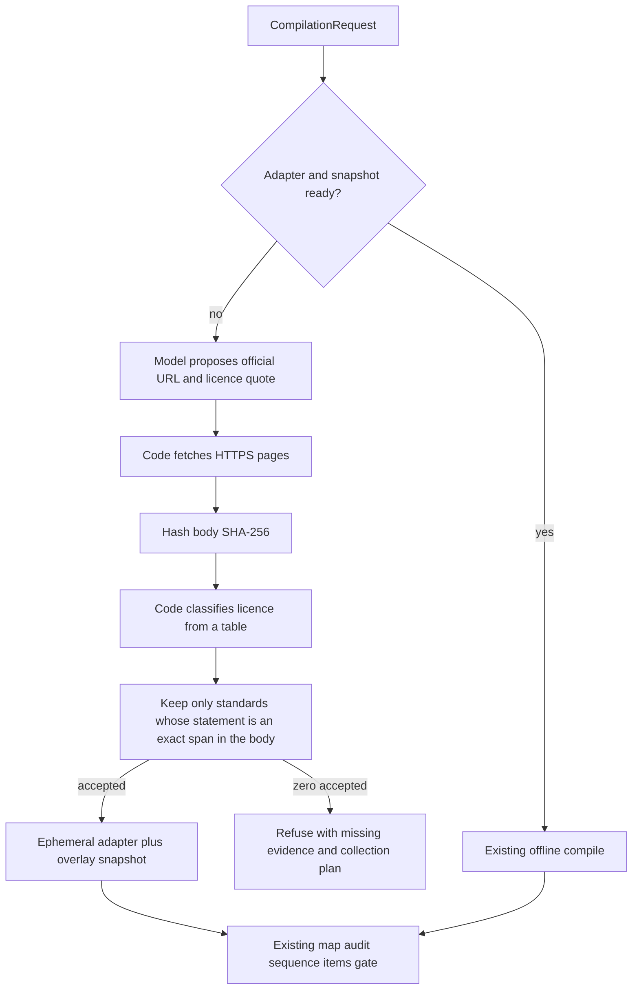

# Primer Compiler

Turns an official curriculum into a sequenced course and a standards tagged question bank, and refuses to ship anything
it cannot trace to a source, a prerequisite and a passing check.

**Live: https://primer-compiler-eight.vercel.app** — public, no sign-in. See [Live](#live) for what the deployment does
and does not run.

> **Read [`ENGINEERING_HANDOFF.md`](./ENGINEERING_HANDOFF.md) first.** It is the single document that carries the problem,
> the product requirements, the system design, the demo script, the ownership split and the timeline. You do not need the
> 32,000 word research report to start building, though it is the evidence layer behind every claim.

## Quickstart

```bash
npm install
npm run dev          # http://localhost:5000, Express and Vite on one port
npm run check        # typecheck
npm test             # contract, validator, gate and compiler tests
npm run build        # production build into dist/
npm run verify       # check, test and build in one go

npm run snapshot        # refetch, hash and rewrite snapshots/. Needs poppler for the PDF sources
npm run demo-fixtures   # recompile the frozen transfer-strip fixtures under client/src/fixtures/
npm run reliability     # ten scripted compiles, and cache the best run as the stage fallback
```

No API key is needed. With no key set, the model client abstains, the gate records the abstention rather than a pass, and
the deterministic path still produces a full bundle, which is also the stage fallback. Copy `.env.example` to `.env` and
set `XAI_API_KEY` to switch the mapper, item writer and standards researcher to `grok-4.6`. No caller changes either way.

Known Australia Year 7/8 maths compiles from committed snapshots and does no network I/O. A request for a location and
stage with no snapshot yet collects during `compile`: the model may name an official URL, then code fetches, hashes and
licence-classifies it. Official exam emulation never collects. Promoting a good run into `snapshots/` stays
`npm run snapshot`.

Try both paths in the app: submit the prefilled form for a draft bundle, then switch the assessment target to official
exam emulation to see the refusal.

## How a compile works

Agents propose. Code decides. The public seam is still two operations: `compile` and `observe`.



If the snapshot is already hashed in the repo, the left path runs and grok only maps and writes items. If it is missing,
the right path runs first: grok-4.6 may name an official HTTPS URL and a licence quote; code fetches the pages, hashes
the body, classifies the licence from a table, and keeps only statements that appear verbatim. Zero accepted statements
is a refusal with a collection plan, not a guessed curriculum. Australia maths years the official ACARA query can name
skip the researcher and use that fetcher. Official exam emulation takes neither path: no blueprint collector, no tokens.

Nothing auto-publishes. `approvedByHuman` is always false out of the compiler. Unknown licence is cite-only.

## Live

**https://primer-compiler-eight.vercel.app**

Student app: **https://primer-compiler-eight.vercel.app/play**

Public, no sign-in. The Vercel project `primer-compiler` is linked to this repository with `main` as its production
branch, so every push to `main` redeploys. The client is a Vite static build and `/api/*` is one Express function, so
compile, stream, graph and export share the in-memory run store within an isolate.

**`XAI_API_KEY` is set, so the live URL runs the real model path.** Pressing Compile calls `grok-4.6` for the curriculum
mapper and the item writer, and, when the snapshot is missing, for a standards researcher. A ready Year 7 compile takes
roughly 30 to 50 seconds. Two things follow from that:

- **Compiles cost tokens, and the URL is public.** There is no rate limit in front of `/api/compile`. If that becomes a
  problem, remove the environment variable and redeploy: the compiler falls back to `MockModelClient`, the gate records
  an abstention rather than a pass, and the deterministic path still returns a complete bundle in milliseconds. Nothing
  else changes and no caller is touched.
- **Model output varies.** Item counts are not fixed run to run, which is why the item writer takes a bounded
  gap-filling pass when a knowledge component ends the first pass with no surviving item. Two passes maximum, then the
  gate reports what it got.

What is real either way, keyed or not: the standards and their codes and wording, the hashed snapshots behind them, the
graph, the sequence, every gate check, every refusal and its collection plan. Only the practice item stems differ.

The **D frozen** and **Year 8** cards on the transfer strip are bundled into the client, so they render real item-writer
output instantly without spending a call. They are the fastest way to see what the writer produces.

To run the keyed path locally:

```bash
cp .env.example .env     # then set XAI_API_KEY
npm run dev
```

To point a Vercel project at your own fork:

```bash
npx vercel link
npx vercel env add XAI_API_KEY   # optional, see above
npx vercel --prod
```

## Ownership map

| Path | Owner |
|---|---|
| `shared/contracts/**` | **Joint, frozen at 0.1.0.** Changes follow `docs/SCHEMA_CHANGELOG.md` |
| `fixtures/**` | Engineer 1 writes, Engineer 2 reads |
| `server/compiler/**`, `server/routes.ts`, `server/index.ts` | Engineer 1 |
| `client/src/**`, `client/src/index.css`, `tailwind.config.ts` | Engineer 2 |
| `tests/contracts.test.ts` | Joint |
| `tests/validators.test.ts`, `tests/compiler.test.ts` | Engineer 1 |
| `docs/**`, `AGENTS.md`, `.cursor/rules/**` | Either, append only |

Full rules, communication protocol and integration checkpoints: `docs/PARALLEL_BUILD.md` and section 20 of the handoff.

## Current status

Working today, verified by `npm run verify`.

**Real sources, hashed.** Six sources are fetched by `npm run snapshot`, SHA-256 hashed and committed under
`snapshots/`. A ready compile (Australia Year 7/8 maths) does no network I/O, and every digest in a run manifest is
checkable against a file in this repository. The store recomputes each digest at start-up and fails the process if bytes
and digest disagree. A missing snapshot is collected into a run-scoped overlay instead of written back to git.

| Source | Licence | What it carries |
|---|---|---|
| ACARA V9, Year 7 Mathematics | CC BY 4.0 | 30 content descriptions, 20 achievement standard segments, 118 elaborations |
| ACARA V9, Year 8 Mathematics | CC BY 4.0 | 27 content descriptions |
| ACARA copyright and terms of use | CC BY 4.0 | the licence itself |
| IES interleaved practice efficacy study | cite only | evidence behind the interleaving decision |
| IES practice guide on organizing instruction | cite only | evidence behind the spacing decisions |
| Rosenshine, *Principles of Instruction* | cite only | evidence behind the guided-practice target |

**Standards are read, never authored.** Every `StandardNode` carries the authority's own code verbatim, the authority's
own wording, and an evidence span that matches the hashed bytes. All 30 Year 7 content descriptions span-match.

**Three real agent stages, behind one seam.** The `ModelClient` interface has two implementations: `XaiModelClient`, using
`grok-4.6` with strict structured outputs, and `MockModelClient`. Selecting one changes no caller.

- The **standards researcher** runs only when a snapshot is missing. It may name an official URL, a licence quote and
  candidate statements. Code then fetches, hashes, classifies the licence and span-locks the statements. The model never
  sets `mayRedistribute`.
- The **curriculum mapper** decomposes fetched content descriptions into knowledge components, prerequisite edges and
  misconceptions. The model proposes pedagogy; code owns provenance. A standard code the model invents is dropped and
  counted, a dangling edge is dropped rather than repaired, ids are assigned by code, and confidence is computed from
  span matches rather than self-reported.
- The **item writer** writes stems, options, rationales and per-distractor misconception links, then faces the same
  deterministic validators. It rejects rather than repairs, and rejected items still ship with the check that caught
  them, because the rejections are the proof the gates ran.

**Everything falls back rather than fails.** With no `XAI_API_KEY` the mock abstains, the gate records an abstention that
never becomes a pass, and the deterministic path still produces a full bundle. The same fallback catches a rate limit, a
timeout, a refusal, non-JSON and a schema mismatch. A graph still unsound after two repair passes refuses instead of
being sequenced. Official exam emulation refuses before any model call. A collection miss refuses before mapper or item
writer spend a token.

**Transfer, and honest refusal.** One engine, one schema, several stage ladders:

| Case | Ladder | Outcome |
|---|---|---|
| Australia, Year 7 Mathematics | `Year 7` | compiles offline from the committed snapshot |
| Australia, Year 8 Mathematics | `Year 8` | compiles against its own snapshot and `AC9M8*` codes |
| Australia, Year 6 Mathematics | `Year 6` | collects via the official ACARA query, then compiles. One collected run is not “jurisdiction support” |
| Texas / NCERT / unknown location | local labels | researcher may name an official page; code fetches and span-locks, or refuses with a collection plan |
| Official exam emulation | any | **refuses**, no blueprint collector |

`Year 7` and `Middle Stage, Class 7` share an internal ordinal without sharing a label. A registered jurisdiction is not
a supported one. Support requires that jurisdiction's own snapshot, licence posture and gate report. Collection during
compile can produce a draft for this run; it does not write `snapshots/` and it does not unlock GREEN.

**Deterministic validators**, all model-free and blocking: graph acyclicity with cycle naming, dangling edges,
unjustified edges, orphans, misconception resolution, topological order, lesson arc completeness, standards coverage,
item single key, distractor to misconception mapping, option style, demand histogram, calibration labelling, licence
records, snapshot fetch state, and a student information scan that hard blocks.

**Gate arithmetic in code**, with the five level verdict vocabulary and permission tiers. Four refusal paths reach it:
official exam emulation with no blueprint, an unregistered jurisdiction, a jurisdiction with no fetched curriculum, and
a graph that stays unsound.

**Two hard rules the code enforces, not the prose.** No student personal information exists in any contract, fixture,
form field or log, and a deterministic scan hard blocks on a forbidden field name anywhere in a request or artifact.
Nothing auto publishes: every result leaves the compiler with `approvedByHuman: false`, and there is no publish path in
the code.

Express routes for health, demo request, compile, an event list, a server-sent event stream, a graph view and a
cite-only-safe export. A React interface with the intake form, live pipeline status, artifact summary, knowledge graph,
gate verdict, transfer strip and a kid path at `/play`. Run `npm test` for the current suite. `npm run reliability`
scores 10 of 10 against the live model.

Deliberately not built yet: a database, authentication, item calibration, differential item functioning, and any claim
about learning.

## Next actions

**Engineer 1, compiler.** The original handoff items are done, and missing snapshots now collect inside `compile`. What
is left, in order:

1. A learning-science critic as a real model stage, so `check:critic.learning-science` can pass instead of abstaining.
2. Promote a good collected run into `snapshots/` with `npm run snapshot`, so the next compile of that stage is offline.
3. A blueprint fetcher, which is the only thing standing between the exam-emulation refusal and a real
   `test_emulation` bundle.
4. Span-match the sequencing decisions' evidence, not just the standards, so `check:evidence.span-match` covers every
   citation in a bundle rather than the curriculum layer alone.

**Engineer 2, interface.** Read `client/src/pages/Compile.tsx`, then the four components. Everything you need already
arrives typed.

1. Make the pipeline panel the demo centrepiece: per stage grouping, counters, failures naming the exact rule.
2. Licence badge on the form and provenance detail on a knowledge component.
3. Rejected items visibly rejected with the reason. This is the proof the gates ran.
4. Refusal screen that reads well on a projector.
5. Transfer strip that swaps artifact panes without re-running the pipeline, once Engineer 1 has the frozen cases.
6. Visual pass at 1440 and 375 wide, dark and light, with loading, empty and refusal states.

**Both.** No storage APIs anywhere, no student data anywhere, and no contract change without the process in
`docs/SCHEMA_CHANGELOG.md`.
